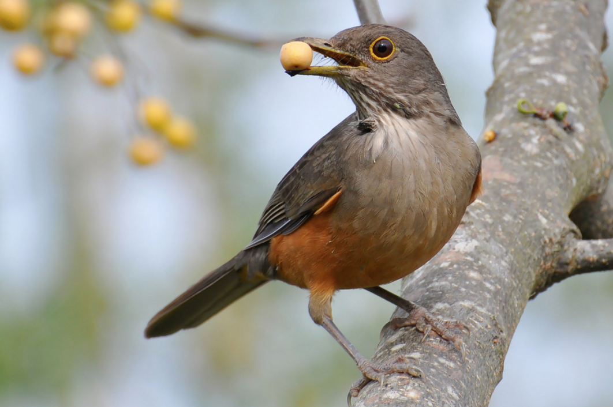

# turdus 

> Turdus is a genus of birds in the Turdidae family, comprising 66 species of blackbirds, thrushes, caraxués, and medium and large-sized sabiás, characterized by their rounded heads and long pointed wings, and generally having a melodious song. [[Wikipedia](https://pt.wikipedia.org/wiki/Turdus)]




Turdus is an interface to consume Twitter data based on specific searches, consolidating this data in file format for the user.

# How to install

```bash
make install
```


# how to run

`make local/run/api`

or via docker:

`make docker/run/api`

# how to lint

```
make lint
```

# how to test

```bash
make test
```
